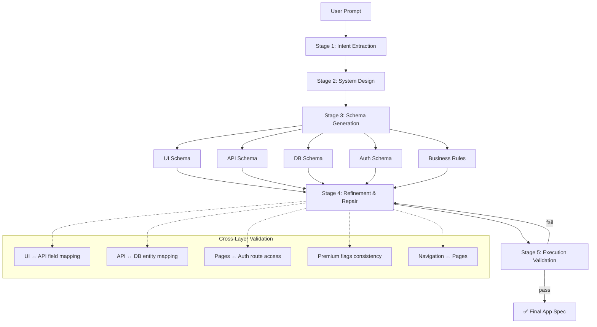

# AI Software Compiler — Prompt → Executable App Config

> A compiler-style pipeline that transforms natural language product prompts into strict, validated, executable application configurations.

## Problem Statement

Given an open-ended product prompt like:

> "Build a CRM with login, contacts, dashboard, role-based access, and premium plan with payments. Admins can see analytics."

The system produces a **complete, validated app specification** containing:
- **UI Schema**: pages, layouts, components, forms, tables, navigation
- **API Schema**: endpoints, methods, request/response contracts, validation
- **Database Schema**: tables, columns, relations, enums, indexes
- **Auth Schema**: roles, permissions, route access control
- **Business Rules**: premium gating, role rules, workflows, constraints

This is NOT a single-prompt wrapper. It's a **multi-stage compiler** with typed schemas, cross-layer validation, intelligent repair, and execution readiness verification.

---

## Architecture



### Why Compiler-Like Design?

| Aspect | Traditional LLM Wrapper | This System |
|--------|------------------------|-------------|
| Architecture | Single prompt → JSON | 5-stage pipeline with typed interfaces |
| Validation | Hope for the best | Schema enforcement + cross-layer checks |
| Error handling | Full retry | Targeted repair of broken subtrees |
| Determinism | Variable | Low temperature + fixed templates + schema parsing |
| Reliability | Inconsistent | Validated and proven executable |

---

## Pipeline Stages

### Stage 1: Intent Extraction
Parses raw natural language into structured intent: features, entities, roles, actions, constraints, monetization model, and ambiguities.

### Stage 2: System Design
Converts structured intent into an architecture plan: modules, page map, entity model, role hierarchy, feature map, and user flows.

### Stage 3: Schema Generation
Generates 5 independent schemas from the architecture plan: UI, API, DB, Auth, Business Rules. Each validated against strict Pydantic models.

### Stage 4: Refinement & Repair
Runs cross-layer consistency checks and automatically repairs issues:
- UI form fields → API request fields
- API endpoints → DB tables
- Protected pages → auth route_access entries
- Permissions → defined roles
- Premium flags → consistent across all layers
- Navigation routes → actual pages

Uses **targeted repair** (not brute retry): RepairPlanner analyzes each issue, TargetedRegenerator fixes only the broken part, then re-validates.

### Stage 5: Execution Validation
Proves the final spec is actually usable by checking that all routes, forms, endpoints, entities, and auth rules compose into a runnable application. Produces a readiness score (0–100%).

---

## Tech Stack

| Layer | Technology | Rationale |
|-------|-----------|-----------|
| Frontend | Next.js + TypeScript | Modern, fast, typed |
| Backend | FastAPI + Python 3.11 | Pydantic-native, async |
| Validation | Pydantic v2 | Strict schema enforcement |
| LLM | OpenAI (abstracted) | With full mock mode fallback |
| Storage | JSON files | Demo simplicity |

---

## Setup & Running

### Prerequisites
- Python 3.11+
- Node.js 18+
- npm

### Quick Start

```bash
# 1. Clone and enter directory
cd "ai platfrom"

# 2. Copy environment config
cp .env.example .env

# 3. Setup backend
cd backend
python3 -m venv venv
source venv/bin/activate
pip install -r requirements.txt
cd ..

# 4. Setup frontend
cd frontend
npm install
cd ..

# 5. Start backend (terminal 1)
cd backend && source venv/bin/activate
uvicorn main:app --reload --port 8000

# 6. Start frontend (terminal 2)
cd frontend
npm run dev

# 7. Open http://localhost:3000
```

### Mock Mode (No API Key Required)
The system runs in **mock mode by default** — producing deterministic, realistic outputs without any API calls. Set `MOCK_MODE=true` in `.env` (or just don't provide an API key).

### With OpenAI API Key
```bash
# In .env:
OPENAI_API_KEY=sk-your-key
MOCK_MODE=false
```

### Run Tests
```bash
cd backend && source venv/bin/activate
python -m pytest tests/ -v
```

### Run Benchmark
```bash
cd backend && source venv/bin/activate
python -m evaluation.benchmark_runner
```

---

## Sample Prompts to Test

1. **CRM** (preloaded): "Build a CRM with login, contacts, dashboard, role-based access, and premium plan with payments. Admins can see analytics."

2. **E-Commerce**: "Create an online store with product listings, shopping cart, checkout with Stripe, admin panel for inventory management, customer reviews, and order tracking."

3. **LMS**: "Build a learning management system with courses, quizzes, student progress tracking, instructor dashboard, certificate generation, and discussion forums."

---

## Validation & Repair Strategy

### Validation Layers
1. **Syntax** — Valid JSON
2. **Schema** — Pydantic model conformance (required fields, types, enums)
3. **Consistency** — Cross-layer field/reference mapping
4. **Semantic** — Logical contradictions, orphaned entities

### Repair Strategy
- **Not brute retry**: RepairPlanner categorizes each issue (add_field, fix_reference, sync_flag, add_entry)
- **Targeted**: TargetedRegenerator patches only the specific broken section
- **Bounded**: Maximum 3 repair cycles to prevent infinite loops
- **Tracked**: Full repair report with issue type, location, action taken

---

## Cost vs. Quality Tradeoff

| Factor | Details |
|--------|---------|
| LLM Calls per run | 7 (1 intent + 1 design + 5 schemas) |
| Repair cost | Targeted fix ≈ 0 extra calls (rule-based repair) |
| Full retry cost | Would be 7 additional calls per retry |
| Mock mode cost | $0 — deterministic outputs |
| Temperature | 0.1 — maximizes consistency |
| Cacheability | Each stage is independently cacheable |

**Key insight**: Rule-based repair is ~infinitely cheaper than LLM-based retry for structural issues (missing fields, flag mismatches, reference gaps).

---

## Evaluation Methodology

- **20 prompts**: 10 realistic applications + 10 edge cases
- **Edge cases**: vague, conflicting, incomplete, role ambiguity, monetization ambiguity, single-word, contradictory roles, over-specified
- **Metrics**: success rate, repair count, latency by stage, execution score, schema validation pass rate

---

## Limitations & Future Improvements

### Current Limitations
- Schema generation is sequential (could be parallelized)
- Mock mode returns CRM-like data for all prompts
- No streaming of stage results to frontend
- No prompt history or modification support

### Future Improvements
- Parallel schema generation (5 concurrent LLM calls)
- Streaming SSE pipeline updates
- Code stub generation from final spec
- Prompt versioning and diff-based modification
- Larger evaluation dataset with automated scoring
- Cost tracking per pipeline run

---

## Project Structure

```
├── backend/
│   ├── main.py                    # FastAPI entry point
│   ├── config.py                  # Settings
│   ├── pipeline/                  # 5 pipeline stages + orchestrator
│   ├── schemas/                   # 8 Pydantic schema modules
│   ├── validators/                # JSON, cross-layer, semantic validators
│   ├── repair/                    # Repair planner + targeted regenerator
│   ├── llm/                       # Provider abstraction + prompt templates
│   ├── mock/                      # Deterministic mock responses
│   ├── evaluation/                # Dataset + benchmark runner + metrics
│   └── tests/                     # pytest test suite
├── frontend/
│   └── src/app/                   # Next.js app with pipeline UI
├── .env.example
├── Makefile
├── README.md
└── loom_talking_points.md
```
